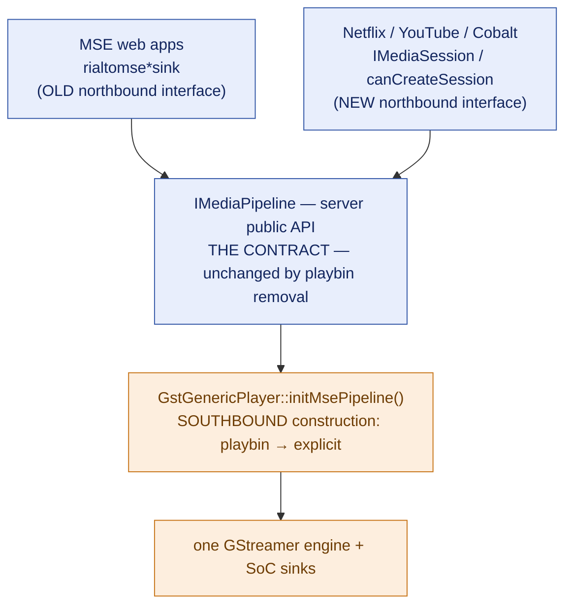
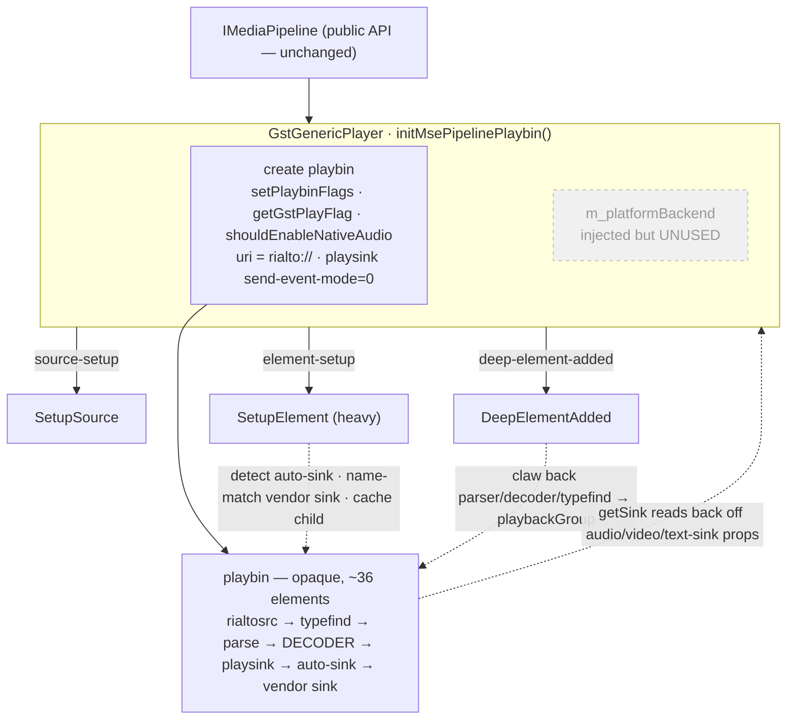
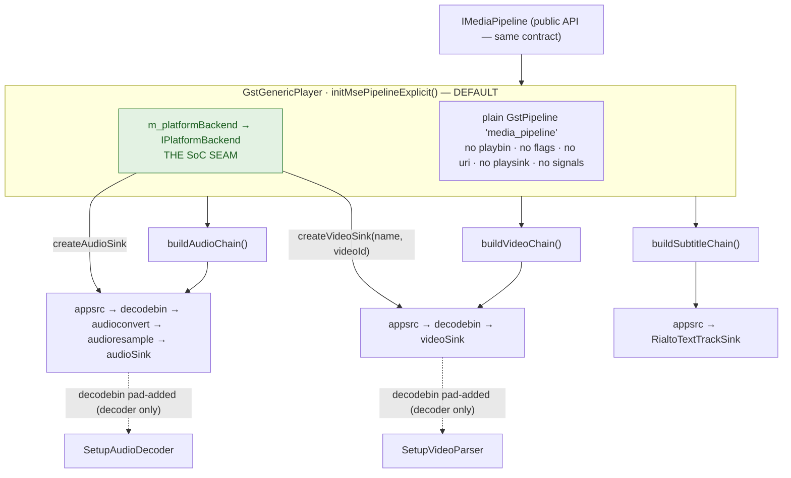
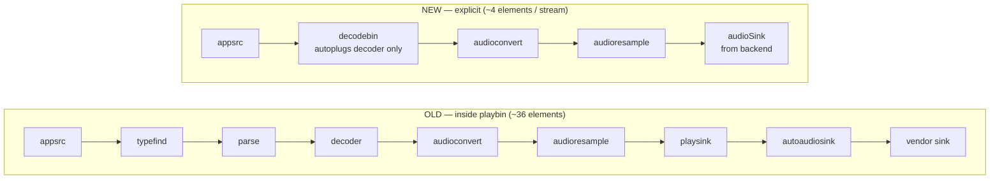
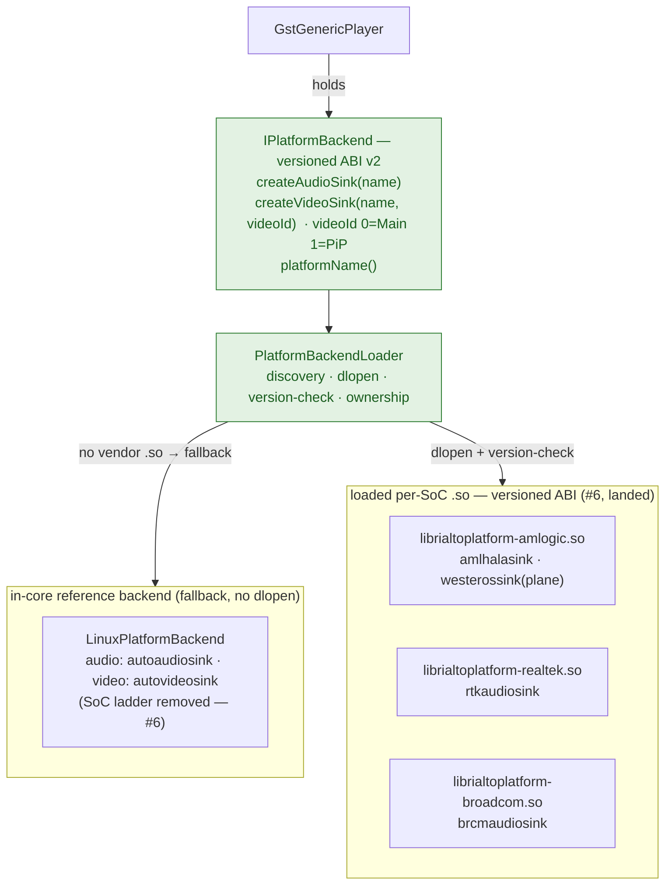

# Rialto Server Pipeline Architecture — Playbin vs Explicit Construction

**TL;DR** — This document shows the Rialto **server**'s internal component layout before and after
the playbin-removal transformation. The northbound `IMediaPipeline` contract is identical in both;
what changes is *how the server builds its internal GStreamer graph* (southbound) and *where the
SoC-specific sink selection lives* (the `IPlatformBackend` seam). The diagrams render as graphics on
GitHub and in VS Code (Markdown Preview Mermaid Support), and are also exported as standalone images
next to this file: `diagram-00-two-axes`, `diagram-01-old-playbin`, `diagram-02-new-explicit`,
`diagram-03-per-stream`, `diagram-04-backend-seam` (each as both `.svg` and `.png`). Regenerate with
`npx -y @mermaid-js/mermaid-cli -i ARCHITECTURE-playbin-vs-explicit.md -o out.svg`.

---

## 0. Two orthogonal axes (read this first)

The transformation has two independent "old vs new" stories. Conflating them is the usual source of
confusion. **Playbin removal touches only the southbound axis.**

- **Axis A — northbound interface** (blue): the GStreamer-sink idiom (`rialtomse*sink`, the 100s of MSE
  web apps) and the new `IMediaSession` path **coexist**. Backward-compatible, untouched here. Covered
  by the `rialto-gstreamer` suite + component tests.
- **Axis B — southbound construction** (orange): `playbin` → explicit. A private server implementation
  detail, unified to one model. **This is what the rest of this document is about.**

---

## 1. OLD layout — playbin owns the graph

**Shape:** *reactive*. playbin autoplugs the whole graph, then `SetupElement`/`DeepElementAdded` reach
*into* it after the fact to detect sinks, match vendor names, and claw back decoder/parser handles. The
SoC backend is dead weight. `playbackGroup` and auto-sink-child caching exist only to recover handles
playbin hid.

---

## 2. NEW layout — Rialto builds the graph; the backend owns the sinks

**Shape:** *deterministic*. Rialto builds and links every element up-front. Sinks come from
`IPlatformBackend`. The only thing still autoplugged is the single decoder inside a 1-deep `decodebin`;
two tiny tasks (`SetupAudioDecoder`/`SetupVideoParser`) configure that decoder/parser when its pad
appears. Telemetry and codec-switch handles are populated *as we build* — nothing to claw back.

---

## 3. Per-stream graph — same observable behaviour, far fewer elements

`ParityTest` asserts the public-API behaviour is identical on both paths; the nails measured the cost
difference (≈36 vs ≈4 elements, lazy-construction deadlock, 155 ms vs 0.06 ms resume).

Video drops the audioconvert/resample tail (`appsrc → decodebin → videoSink`); subtitle is just
`appsrc → RialtoTextTrackSink`.

---

## 4. The backend — `IPlatformBackend` SoC seam

The versioned `extern "C"` ABI (`kPlatformBackendAbiVersion = 2`) that the whole transformation exists
to establish. The core builds elements through the same `IGstWrapper`/`IGlibWrapper` it injects via
`PlatformHostContext`, preserving the dependency-injection test seam.

`PlatformBackendLoader` (#6, landed) acquires the backend: it `dlopen`s a per-SoC
`librialtoplatform-*.so` (version-checked against `kPlatformBackendAbiVersion`) and otherwise falls
back to the in-core reference backend. The transitional vendor-sink ladder has lifted out of
`LinuxPlatformBackend` (now `autoaudiosink`/`autovideosink` only), so the SoC layer is upgraded without
re-testing every platform — upper layers stay binary-compatible across the stable ABI. See
`ARCHITECTURE-rialto-overview.md` §2 for the dlopen layering and load decision.

---

## 5. What is removed, what is preserved

| Removed (southbound playbin machinery) | Preserved |
| --- | --- |
| `initMsePipelinePlaybin`, `setPlaybinFlags`, `getGstPlayFlag`, `shouldEnableNativeAudio`, playsink/uri tweaks | `IMediaPipeline` public contract (both diagrams, top box) |
| `SetupSource`, `SetupElement`, `DeepElementAdded`, `UpdatePlaybackGroup` reactive tasks | The northbound interfaces (`rialtomse*sink` + `IMediaSession`) and their tests |
| Auto-sink child caching (`getSinkChildIfAutoVideoSink/Audio`, `addAuto*SinkChild`) | `ParityTest`'s behavioural cases — kept as the explicit-path spec |
| `getSink`-via-playbin property reads | `external/rialto-upstream` — playbin-only baseline, external reference |
| The dedicated playbin **construction/reactive-task unit tests** | `IPlatformBackend` seam — was dead, now load-bearing |
