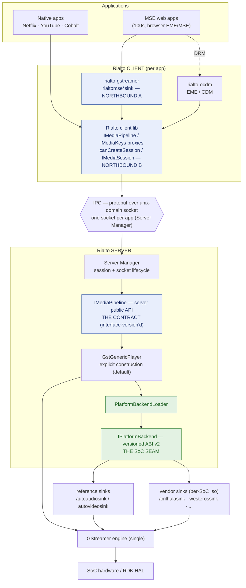
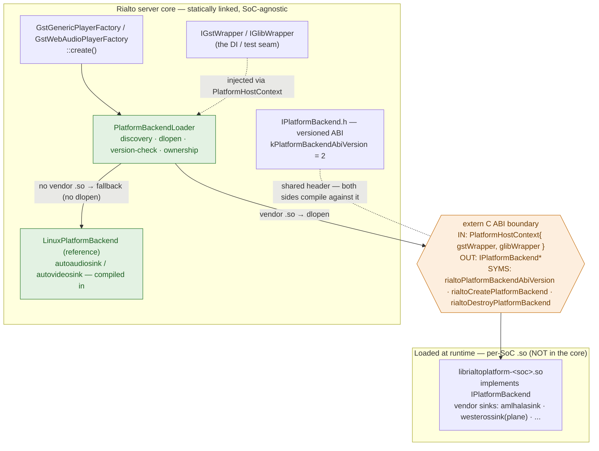
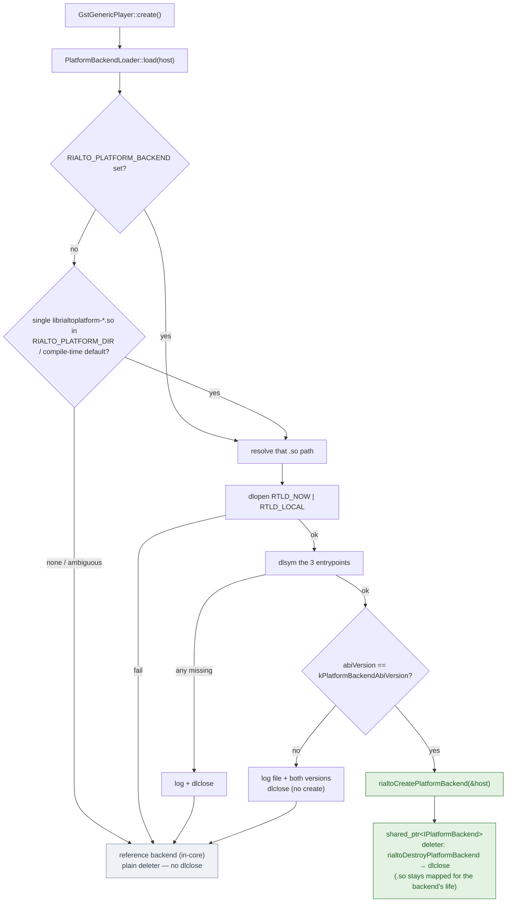
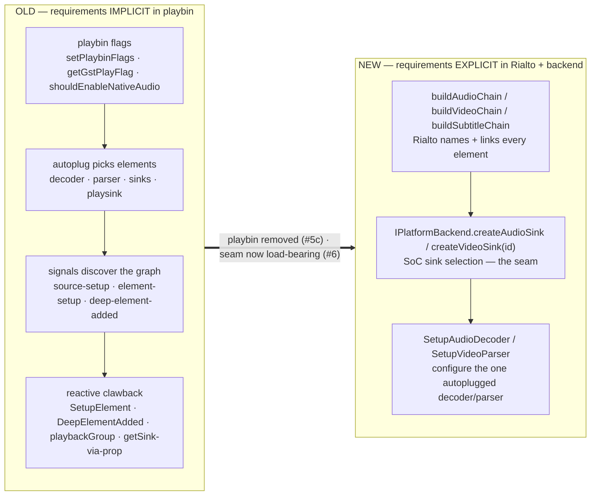
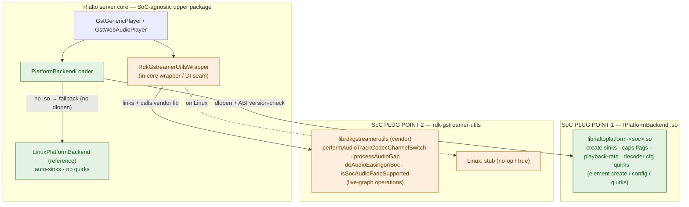
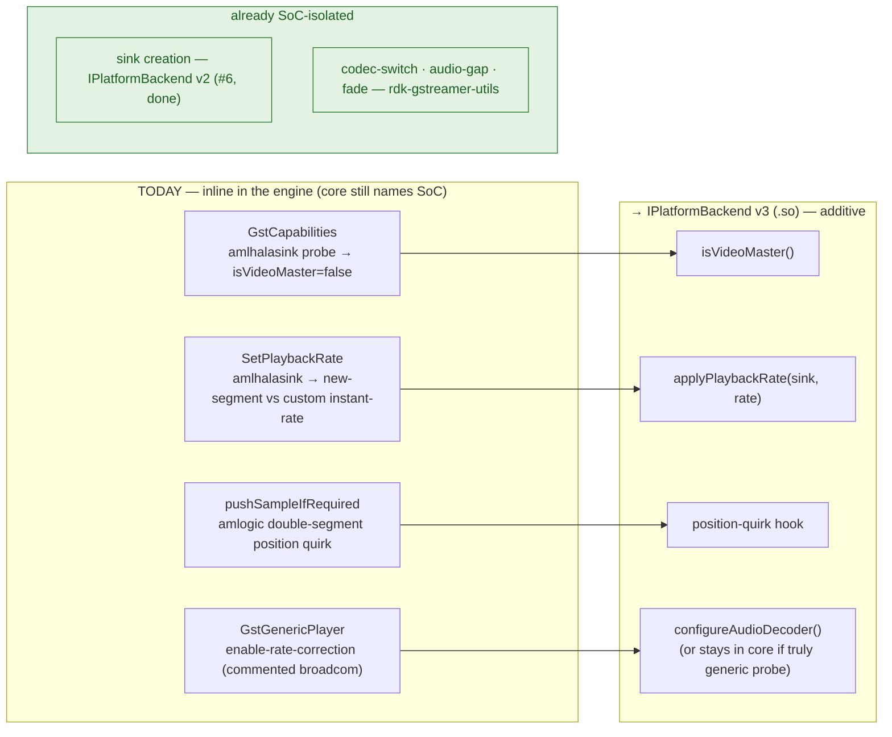

# Rialto Architecture — Overview & the dlopen Platform Backend

**TL;DR** — Five pictures. (1) **High-level Rialto**: a client/server media stack split over
protobuf IPC, with two coexisting northbound interfaces converging on one `IMediaPipeline` contract,
one GStreamer engine, and the `IPlatformBackend` SoC seam. (2) **dlopen layering**: what stays in the
statically-linked core (the factory, `PlatformBackendLoader`, the reference backend, the wrappers, the
versioned ABI header) versus what is loaded at runtime (the per-SoC `.so`), and exactly what crosses
the `extern "C"` boundary. (3) **Where requirements live**: playbin used to define the pipeline
*implicitly* (flags + autoplug + signals + reactive clawback); the new model defines it *explicitly*
in Rialto's chain builders plus the backend. (4) **How a platform plugs in**: the SoC lower layer's *two
internal plug points* — the `IPlatformBackend` `.so` (dlopen, versioned ABI) and the
`rdk-gstreamer-utils` library (linked, via `RdkGstreamerUtilsWrapper`). (Not to be confused with the
two *external* surfaces — the MSE sinks vs the native API — in §1.) (5) **SoC migration map**: which inline engine concern moves to which
seam home (the `complete-soc-platform-isolation` plan). The diagrams render on GitHub and in VS Code
(Markdown Preview Mermaid Support); export with
`npx -y @mermaid-js/mermaid-cli -i ARCHITECTURE-rialto-overview.md -o out.svg`.

Companion: `ARCHITECTURE-playbin-vs-explicit.md` (the detailed southbound construction diagrams).

---

## 1. High-level architecture

Rialto is a **client/server** system: each app links a thin Rialto client that proxies the media API
to a central Rialto **server** over a per-app protobuf/unix-domain-socket. The server owns the single
GStreamer engine and selects SoC sinks through the `IPlatformBackend` seam.

- **Two external (northbound) surfaces coexist** (blue) — the app's choice, both supported:
  - **MSE GStreamer sinks** — old/current apps keep *their own* GStreamer pipeline and slot Rialto's
    `rialtomse*sink` elements in as the sink stage. No app rewrite.
  - **Native interface** — apps upgraded to *pass data through and make calls on* Rialto's native API
    (`canCreateSession`/`IMediaSession`), no app-side GStreamer (Netflix/YouTube/Cobalt).
  Both resolve to the same `IMediaPipeline` server contract. This coexistence is the backward-compatible
  spine of the transformation — these are the only "surfaces" external users see.
- **One engine, one seam** (green): the server runs a single GStreamer engine; all SoC specifics sit
  behind `IPlatformBackend`, acquired by `PlatformBackendLoader`.

---

## 2. The dlopen platform backend

### 2a. Layering — what stays in the core vs what is loaded

The core names **no SoC**. The reference backend is compiled in and is the **can't-fail fallback** (no
`dlopen`). A vendor layer ships exactly one `librialtoplatform-*.so`; only three C symbols, a
host-context in, and an `IPlatformBackend*` out ever cross the boundary — so the SoC layer is upgraded
without rebuilding or re-certifying the core.

### 2b. Load decision — discovery, version-check, fallback

---

## 3. Where the pipeline requirements live — playbin vs explicit

playbin used to *define the requirements implicitly*: its flags, autoplug rules, and signals decided
which elements and properties the graph had, and Rialto reached back in reactively to recover handles.
The new model makes every requirement *explicit* — Rialto's chain builders name and link each element,
and the backend owns SoC sink selection.

Net effect: the graph drops from ≈36 elements to ≈4 per stream, construction is deterministic (no
lazy-autoplug deadlock), and "what the pipeline requires" is now readable in the source rather than
inferred from playbin's behaviour. The northbound `IMediaPipeline` contract is unchanged throughout.

---

## 4. How a platform plugs in — the SoC lower layer (internal plug points)

These are **internal, southbound** plug points — the SoC lower layer — distinct from the two *external*
surfaces of §1 (which are the app's choice). A platform plugs into Rialto through **two** internal plug
points today. Both are SoC-specific, both ship per-platform, both have a Linux default in-core:

- **Plug point 1 — `IPlatformBackend` `.so`** (green): *element-local* concerns — sink creation, element
  configuration, capability flags, platform quirks. Loaded by `dlopen` with a version-checked ABI; the
  reference backend is the in-core Linux default.
- **Plug point 2 — `rdk-gstreamer-utils`** (orange): *cross-cutting live-graph operations* the vendor
  already implements — seamless audio codec-channel switch, audio-gap processing, audio fade/easing.
  Linked as a library and reached through `RdkGstreamerUtilsWrapper` (the in-core DI seam); Linux uses
  the no-op stub. `performAudioTrackCodecChannelSwitch` takes the whole playback group and cannot be
  reimplemented per-element, which is why it stays distinct from the `.so` today.

Home rule: **element create / config / caps / quirks → plug point 1; live-graph ops already owned by the
vendor lib → plug point 2.** Both are versioned and shipped per-SoC; the goal is to collapse them to a
single seam, and the eventual AIDL-HAL lower layer subsumes both.

---

## 5. SoC migration map — what moves where

The `complete-soc-platform-isolation` plan finishes the isolation: every SoC concern still inline in
the engine moves to a seam home (additive `IPlatformBackend` v2 → v3), and per-SoC `.so`s carry it so
current platforms stay stable.

Per-concern detail:

| # | Concern (today) | Site | Moves to | Reference (Linux) default | Vendor `.so` does |
| --- | --- | --- | --- | --- | --- |
| 1 | video-master capability | `GstCapabilities` | `isVideoMaster()` (v3) | `true` | amlogic returns `false` |
| 2 | playback-rate application | `SetPlaybackRate` | `applyPlaybackRate(sink, rate)` (v3) | custom instant-rate event on pipeline | amlhalasink sends a new-segment event on the sink pad |
| 3 | position quirk | `pushSampleIfRequired` | position-quirk hook (v3) | no extra push | amlogic pushes the double segment |
| 4 | decoder rate-correction | `GstGenericPlayer` | `configureAudioDecoder()` (v3) — or **stays in core** if it is a pure property-probe with no SoC name | property-probe sets `enable-rate-correction` if present | same, owned by the backend |
| — | sink creation | `LinuxPlatformBackend` | `IPlatformBackend` v2 | auto-sinks | vendor sinks (**done, #6**) |
| — | codec-switch · audio-gap · fade | `RdkGstreamerUtilsWrapper` | `rdk-gstreamer-utils` lib | no-op stub | vendor lib implementation |

Each row is migrated **behaviour-preserving and test-first**, and a platform's inline branch is retired
only once its `.so` passes the conformance suite — so "complete the isolation" never means "regress a
current platform."
